# Face Mask Detection
Face mask detection is an object detection task that detects whether people are wearing masks or not in videos. This repo includes a demo for building a face mask detector using YOLOv5 model. 
<p align="center"> 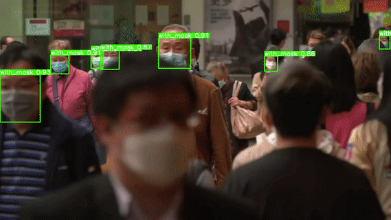</p>

### Dataset
The model was trained on [Face-Mask](https://www.kaggle.com/andrewmvd/face-mask-detection) dataset which contains 853 images belonging to 3 classes, as well as their bounding boxes in the PASCAL VOC format. The classes are defined as follows:
* `With mask`
* `Without mask`
* `Mask worn incorrectly`

### Setup
* Clone this repo and install YOLOv5:
```
git clone https://github.com/spacewalk01/face-mask-detection
cd face-mask-detection

# Install yolov5
git clone https://github.com/ultralytics/yolov5
cd yolov5
pip install -r requirements.txt
```

#### Training
* Download [Face-Mask](https://www.kaggle.com/andrewmvd/face-mask-detection) dataset from Kaggle and copy it into `datasets` folder. 
* Execute the following command to automatically unzip and convert the data into the YOLO format and split it into train and valid sets. The split ratio was set to 80/20%.
```
cd ..
python prepare.py
```
* Start training:
```
cd yolov5
python train.py --img 640 --batch 16 --epochs 100 --data ../mask_config.yaml --weights yolov5s.pt --workers 0
```
#### Inference
* If you train your own model, use the following command for inference:
```
python detect.py --source ../datasets/input.mp4 --weights runs/train/exp/weights/best.pt --conf 0.2
```
* Or you can use the pretrained model `models/mask_yolov5s.pt` for inference as follows:
```
python detect.py --source ../datasets/input.mp4 --weights ../models/mask_yolov5.pt --conf 0.2
```

### Results
The following charts were obtained after training YOLOv5s with input size 640x640 on the `Face Mask` dataset for 100 epochs.

<p align="center">
  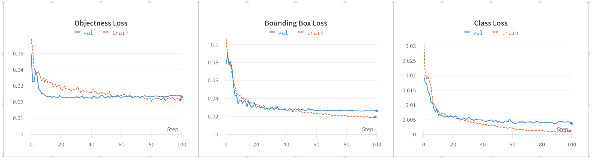
</p>

#### Training Result Curves

Precision-Recall (PR) measures the accuracy of bounding box overlap between predicted bboxes and ground truth bboxes. The three curves below summarize the detector's precision, recall, and precision-recall performance.

| Precision Curve | Recall Curve | PR Curve |
| :-: | :-: | :-: |
| <p align="center"> 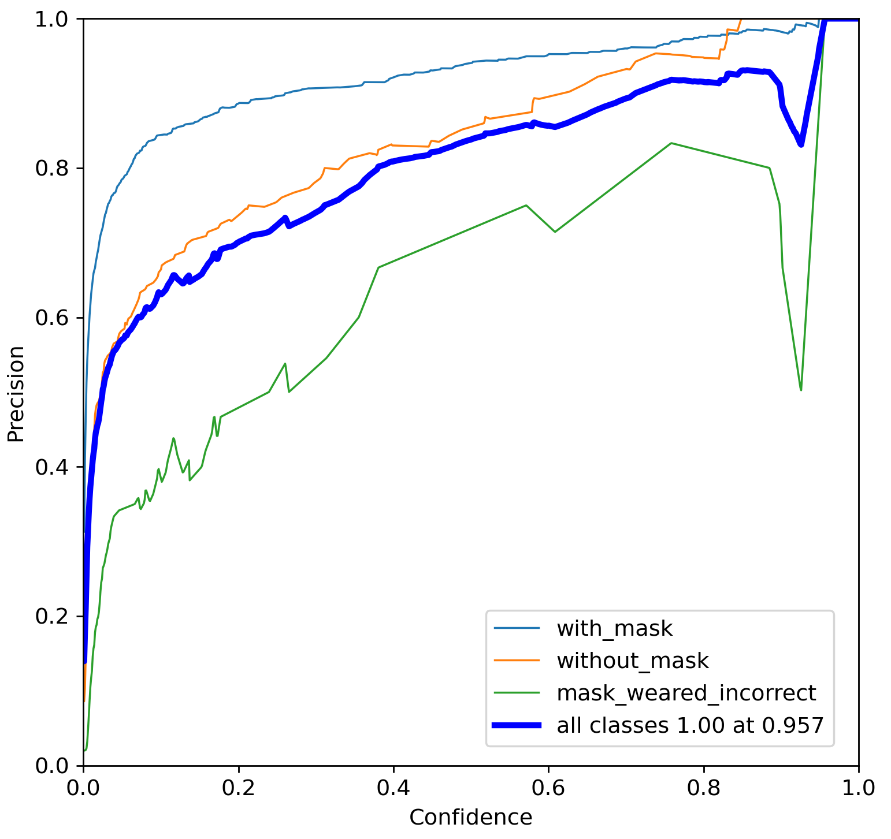</p> | <p align="center"> 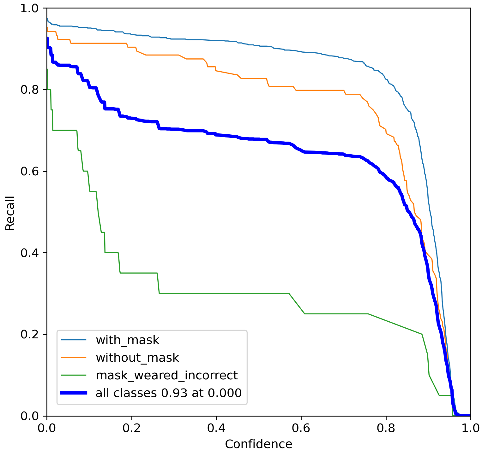</p> | <p align="center"> 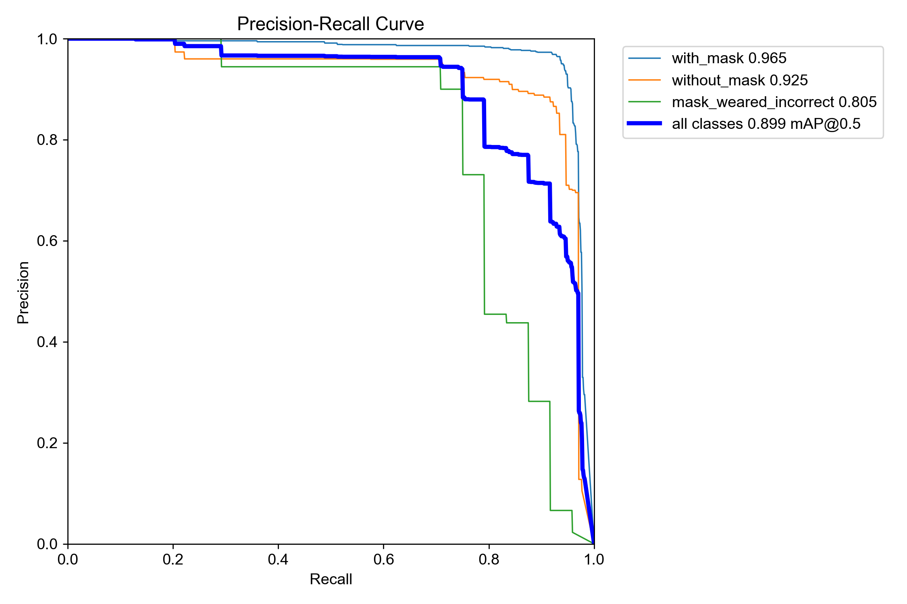</p> |

The following metrics were measured on the valid dataset containing 171 images. High precision and recall scores were obtained on `with mask` and `without mask` classes. However, the performance on `mask weared incorrectly` class was poor due to the imbalanced data.

| Class | #Labels | Precision | Recall | mAP<sup>val<br>0.5 | mAP<sup>val<br>0.5:0.95 |
| :-: | :-: | :-: | :-: | :-: | :-: |
| `with mask` | 630 | 0.94 | 0.9 | 0.95 | 0.64 |
| `without mask` | 104 | 0.86 | 0.82 |  0.9 |  0.6 |
| `mask weared incorrectly` | 20 | 0.72 | 0.3 | 0.43 | 0.24 |
| `total` | 754 | 0.84 | 0.67 | 0.76 | 0.49 |

### Real-World Testing & Failure Case Analysis

After training YOLOv5s for 100 epochs, the model achieved strong performance on the validation set:

| Metric | Score |
|---|---:|
| Precision | 0.914 |
| Recall | 0.851 |
| mAP@0.5 | 0.899 |
| mAP@0.5:0.95 | 0.592 |

The model performed particularly well on clearly visible faces under conditions similar to the training data. However, testing on unseen real-world images revealed several challenging cases. These examples highlight an important distinction between validation performance and real-world robustness.

#### Case 1 — Crowded Scene, Small Faces, and Occlusion

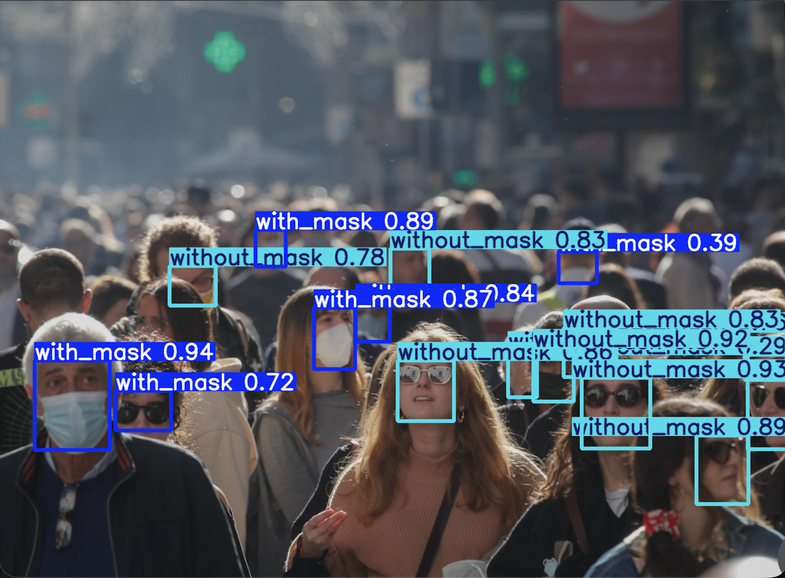

In this crowded outdoor scene, the model correctly detects many clearly visible faces and distinguishes between `with_mask` and `without_mask`. However, some distant or partially visible faces are missed, while overlapping people and facial occlusion increase detection difficulty. Small faces also contain substantially less visual information after image resizing. Sunglasses, hair, masks, and other accessories can further obscure facial features.

Several clearly visible masked faces are correctly classified with high confidence, while more ambiguous or partially occluded faces are occasionally classified as `without_mask`. This suggests that the model performs reliably on large and clearly visible faces, but becomes less robust when faces are small, crowded, or partially occluded.

#### Case 2 — Nighttime Scene, Headgear, and Complex Appearance

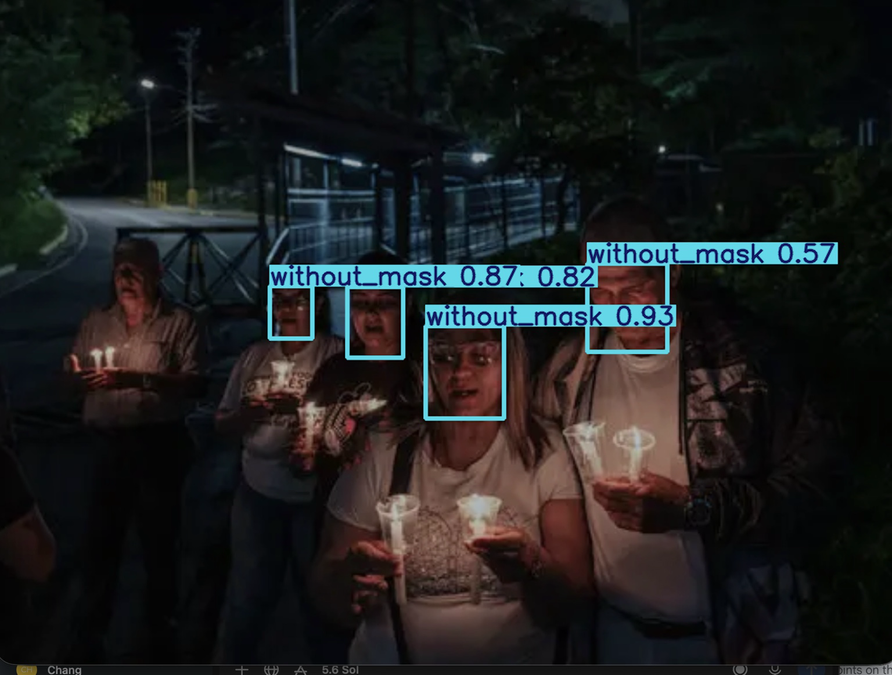

This nighttime group image combines low light, uneven artificial illumination, headgear, and complex appearances. The model detects many visible faces as `without_mask`, with several predictions above 0.80 confidence. Some visible faces are missed entirely, and one face is predicted as `with_mask` with relatively low confidence of approximately 0.39.

Possible contributing factors include low-light conditions, helmets, hats, glasses, partial facial occlusion, non-frontal poses, and differences between real-world images and the training-data distribution. The low-confidence `with_mask` prediction shows that the model becomes uncertain when facial appearance differs substantially from typical training examples.

#### Case 3 — Low-Light and Uneven Illumination

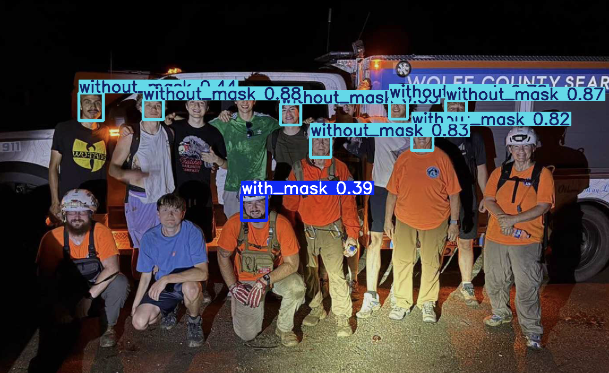

This example demonstrates the effect of challenging illumination conditions. Several well-lit frontal faces are correctly detected as `without_mask`, with confidence scores reaching approximately 0.87–0.93. However, some faces in darker regions are missed entirely.

The main challenge is the large variation in illumination across the image: some faces are illuminated by nearby light sources while others remain heavily shadowed. Low light, strong shadows, reduced contrast, pose variation, partial occlusion, and domain shift can all reduce detection recall.

#### Key Failure Patterns

| Challenge | Observed Effect |
|---|---|
| Small or distant faces | Missed detections |
| Crowded scenes | Missed or overlapping detections |
| Partial occlusion | Incorrect classification or missed detection |
| Low-light conditions | Reduced detection recall |
| Uneven illumination | Inconsistent detection across the same image |
| Sunglasses, helmets, or headgear | Increased classification difficulty |
| Non-frontal poses | Reduced detection reliability |
| Domain shift | Lower robustness than on the validation set |

These failure cases indicate that the model's primary limitation is not classifying clear, frontal, well-lit faces, but maintaining robustness when visual conditions differ from the training distribution.

#### Possible Improvements

1. **Increase training-data diversity:** add more nighttime, crowded, partially occluded, side-view, and low-resolution faces.
2. **Address class imbalance:** collect or augment additional samples for the `mask_weared_incorrect` class, which has substantially fewer examples.
3. **Use targeted data augmentation:** simulate brightness and contrast changes, blur, noise, and random occlusion.
4. **Apply hard-example mining:** add incorrectly classified and missed real-world examples back into the training set.
5. **Evaluate at higher resolution:** improve small-face detection at the cost of additional computation.
6. **Compare model sizes:** evaluate YOLOv5m against YOLOv5s to study the accuracy/speed trade-off.

#### Takeaway

The final YOLOv5s model achieved **0.914 Precision, 0.851 Recall, and 0.899 mAP@0.5** on the validation set after 100 epochs. Real-world testing showed good generalization when faces are clearly visible, while small faces, crowding, occlusion, low illumination, headgear, and domain shift can still cause missed detections and incorrect classifications. Reliable object-detector evaluation therefore requires both quantitative metrics and qualitative analysis of real-world failure cases.

#### Ground Truths vs Predictions

| Ground Truth | Prediction | 
| :-: | :-: |
| 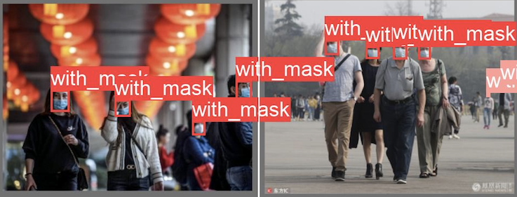 | 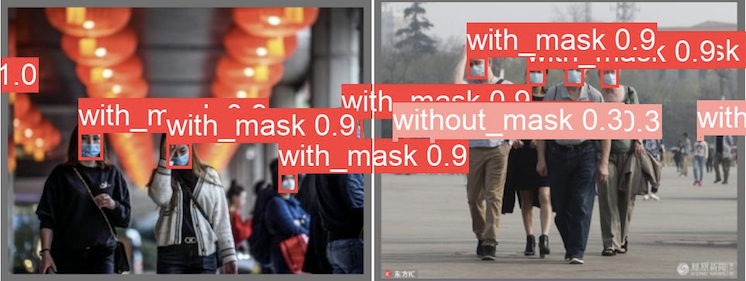 |
| 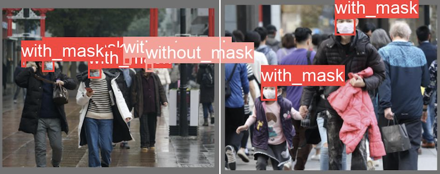 | 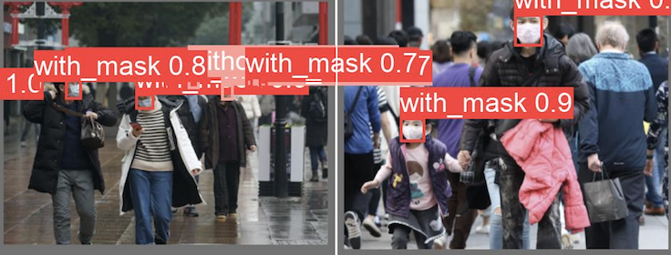 | 
| 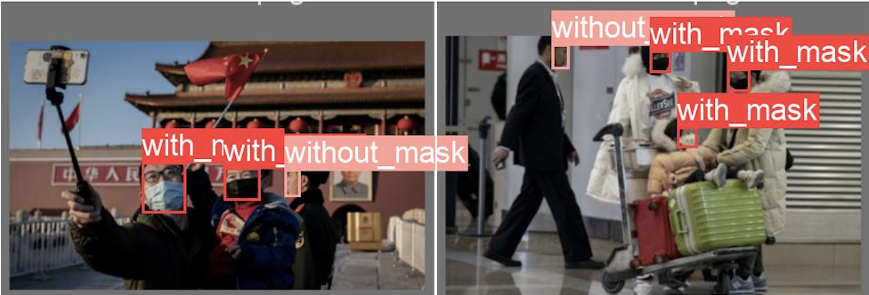 | 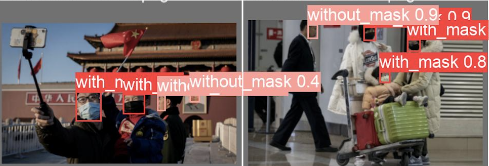 | 
  
### Reference

* [Darknet](https://github.com/pjreddie/darknet/blob/master/scripts/voc_label.py)
* [YOLOv5](https://github.com/ultralytics/yolov5)
